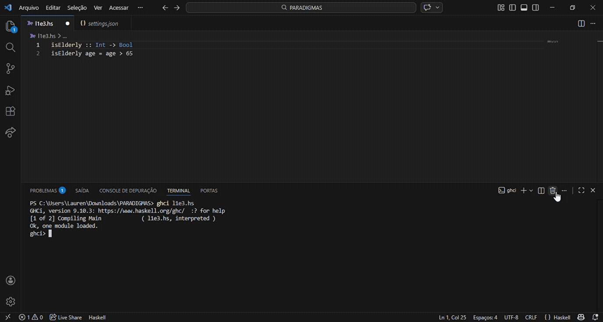
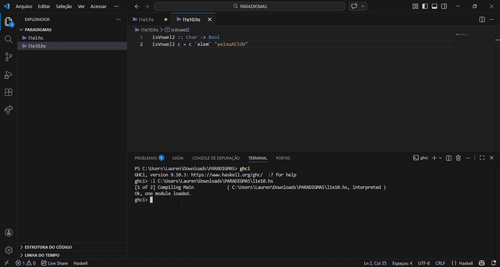
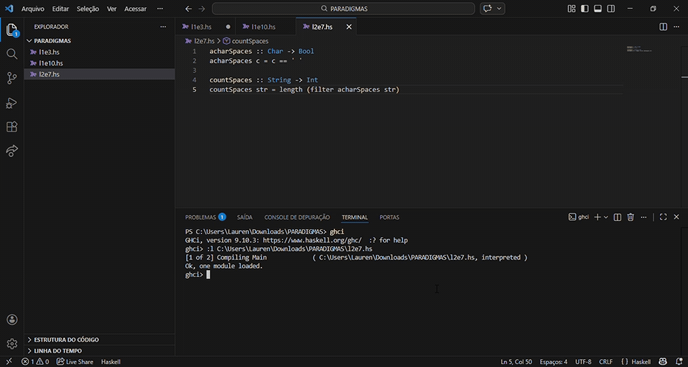

# Funções de Alta Ordem e Funções Lambda
## Funções de Alta Ordem
As **funções de alta ordem** (High Order Functions) podem receber uma ou mais funções como parâmetro, e/ou devolvem outra função como resultado. Ou seja, ela utiliza funções como valores, exatamente igual a outros tipos de dados como int ou string. Isso torna o código mais flexível e reutilizável.

EXEMPLOS:

`Haskell`

- any: verifica se algum elemento da lista satisfaz uma condição.
```hs
temNegativo x = x < 0
any temNegativo [1,2,-3,4]
```
Resultado: `True`

- all: verifica se todos os elementos satisfazem uma condição.
```hs
todosPositivos x = x > 0
all todosPositivos [1,2,3,4]
```
Resultado: `True`

- zipWith: aplica uma função a elementos correspondentes de duas listas.
```hs
soma x y = x + y
zipWith soma [1,2,3] [4,5,6]
```
Resultado: `[5,7,9]`


`Python`

```py
# função de alta ordem
def aplicar(funcao, valor):
    return funcao(valor)

# função passada como argumento
def dobro(x):
    return x * 2

resultado = aplicar(dobro, 5)
print(resultado)
```
Resultado: `10`

## Funções Lambda
As **funções lambda** (funções anônimas) são definidas “na hora”, sem nome, e geralmente usadas apenas uma vez, por exemplo como argumento para outra função. São bastante utilizadas em operações simples, como cálculos rápidos. 
O símbolo utilizado em Haskell para indicar que é uma função lambda: `\`

EXEMPLO:

`Haskell`

- Função normal:
```hs
quadrado x = x * x
map quadrado [1,2,3,4,5]
```

- Função usando lambda:
```hs
map (\x -> x * x) [1, 2, 3, 4, 5]
```

As funções lambda também podem ser armazenadas em variáveis.

EXEMPLO:

`Python`
```py
square = lambda x: x * x # cria uma função lambda e atribui à variável 'square'
print(square(7))  # 49
```

# Exercícios
1. Defina uma função isElderly :: Int -> Bool que receba uma idade e resulte verdadeiro caso a idade seja maior que 65 anos.

`isElderly` recebe uma idade (Int) e verifica se ela é maior que 65.
Retorna `True` se a pessoa for considerada idosa e `False` caso contrário.

2. Agora use a função elem para implementar uma função isVowel2 :: Char -> Bool que verifique se um caracter é uma vogal, tanto maiúscula como minúscula.

`isVowel2` recebe um caractere (Char) e verifica se ele está dentro da lista `"aeiouAEIOU"`.
Retorna `True` se for uma vogal (maiúscula ou minúscula) e `False` se não for.

3. Crie uma função countSpaces que receba uma string e retorne o número de espaços nela contidos. Dica 1: você vai precisar de uma função que identifica espaços. Dica 2: aplique funções consecutivamente, isto é, use o resultado de uma função como argumento para outra.

`acharSpaces` verifica se um caractere é um espaço (`' '`).
`countSpaces` usa `filter` para pegar apenas os espaços da string e `length` para contar quantos existem.

### Referências
https://www.alura.com.br/artigos/high-order-functions?srsltid=AfmBOoryRshW07cbG8-opY8qVkyPPeIMwXUEllGcuULyh1EGIhjllLRH
https://haskell.tailorfontela.com.br/higher-order-functions
https://pythonacademy.com.br/blog/funcoes-lambda-no-python
https://wiki.haskell.org/Anonymous_function
